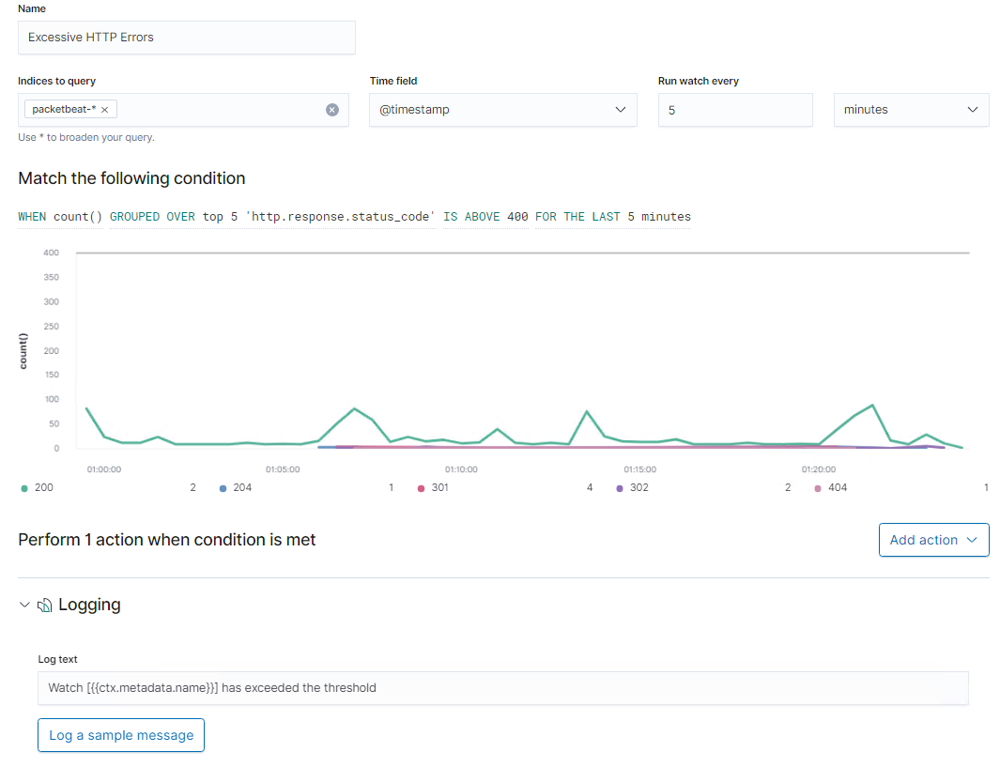
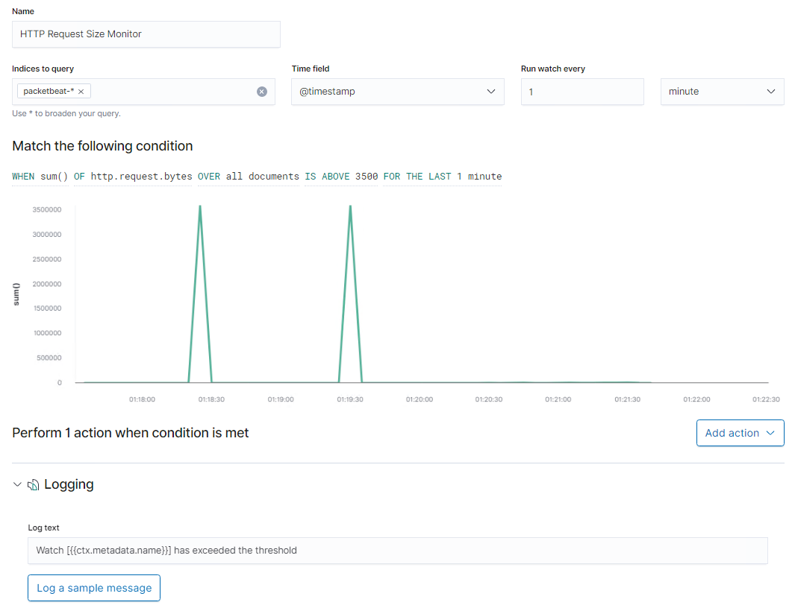
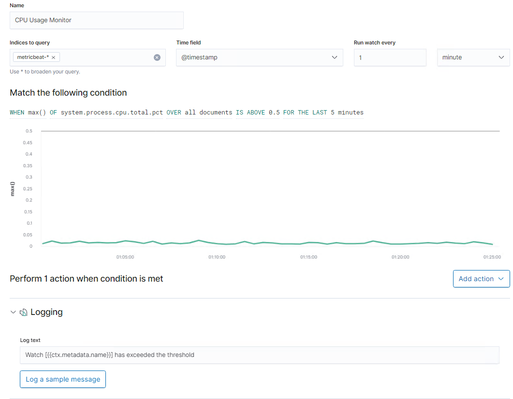

# Blue Team: Summary of Operations

## Table of Contents
- Network Topology
- Description of Targets
- Monitoring the Targets
- Patterns of Traffic & Behavior
- Suggestions for Going Further

### Network Topology

The following machines were identified on the network:
- Target 1 
  - **Operating System**: Linux 
  - **Purpose**: Target Machine 
  - **IP Address**: 192.168.1.110
  
- Target 2 
  - **Operating System**: Linux
  - **Purpose**: Target Machine 
  - **IP Address**: 192.168.1.115

- Attacker Machine 
  - **Operating System**: Kali Linux 
  - **Purpose**: Attacker Machine   
  - **IP Address**: 192.168.1.90

- Elk Server  
  - **Operating System**: Linux 
  - **Purpose**: Monitoring network activity
  - **IP Address**: 192.168.1.100

### Description of Targets

The target of this attack was: `Target 1` (192.168.1.110).

Target 1 is an Apache web server and has SSH enabled, so ports 80 and 22 are possible ports of entry for attackers. As such, the following alerts have been implemented:

### Monitoring the Targets

Traffic to these services should be carefully monitored. To this end, we have implemented the alerts below:

#### Name of Alert 1

Exessive HTTP Errors is implemented as follows:
  - **Metric**: WHEN count () GROUPED OVER top 5 'http.response.status_code'
  - **Threshold**: IS ABOVE 400
  - **Vulnerability Mitigated**: Enumeration/Brute Force
  - **Reliability**: 400 codes are client and server errors, and measuring by error codes 400 and above can filter out successful      responses, and alert when a large number of these errors occur. Therefore, this alert is higly reliable. 

#### Name of Alert 2

HTTP Request Size Monitor is implemented as follows:
  - **Metric**: WHEN sum () OF http.request.bytes OVER all documents 
  - **Threshold**: IS ABOVE 3500 FOR THE LAST 1 minute 
  - **Vulnerability Mitigated**: Code injection at DDoS
  - **Reliability**: Moderately reliable as it can produce false positives for large amounts of legitimate HTTP traffic.

#### Name of Alert 3

 CPU Usage Monitor is implemented as follows:
  - **Metric**: WHEN max() OF system.process.cpu.total.pct OVER all documents 
  - **Threshold**: IS ABOVE 0.5 FOR THE LAST 5 minutes
  - **Vulnerability Mitigated**: malicious software and malware downloads and uploads, and large amounts of resources being used by hidden programs 
  - **Reliability**: It can help identify malicious sofware on the network using more resources than normally seen, and can imporvide the use of CPU resources, making it highly reliable and useful 

### Suggestions for Going Further (Optional)

- Each alert above pertains to a specific vulnerability/exploit. Recall that alerts only detect malicious behavior, but do not stop it. For each vulnerability/exploit identified by the alerts above, suggest a patch. E.g., implementing a blocklist is an effective tactic against brute-force attacks. It is not necessary to explain _how_ to implement each patch.

The logs and alerts generated during the assessment suggest that this network is susceptible to several active threats, identified by the alerts above. In addition to watching for occurrences of such threats, the network should be hardened against them. The Blue Team suggests that IT implement the fixes below to protect the network:
- Vulnerability 1

  - WordPRess Hardening: Install regular update to WordPress. Install additional security plugins. Disable unused Wordpress features such WordPress XML-RPC, and WordPress REST API. Do not allow publicly accessible login information and block users from being viewed publicly as well. 
  - **Why It Works**: Regular updates will ensure that all known vulnerabilities are patched and a security plignin may provide features such as a firewall and scanning capabilities. Disabling WrodPRess REST API blocks WPScan from enumerating users. Disabling public access to WorkPress logins will also mitigation intrusion efforts
- Vulnerability 2
  - DDoS and Code Injection Hardening: Limit HTTP requests to the server by size, and length of request 
  - **Why It Works**: This will reject any request that are over the set threshold of HTTP request size and length
- Vulnerability 3
  - Hardening Against Nalware. Viruses, and hidden software: Instal and update an antivirus suite, and an Instrusion Detection System 
  - **Why It Works**: A good anti-virus will not only protect the system but also scan it for malicious software, and the Intrusion Detection System can motnitor network packets to weed out intrusion attempts
