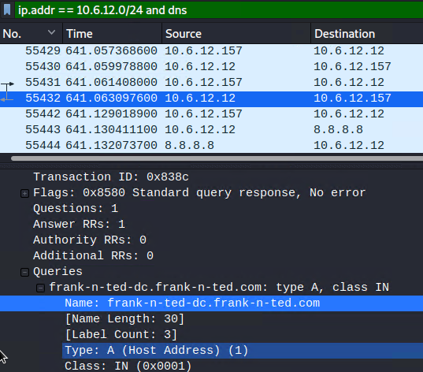
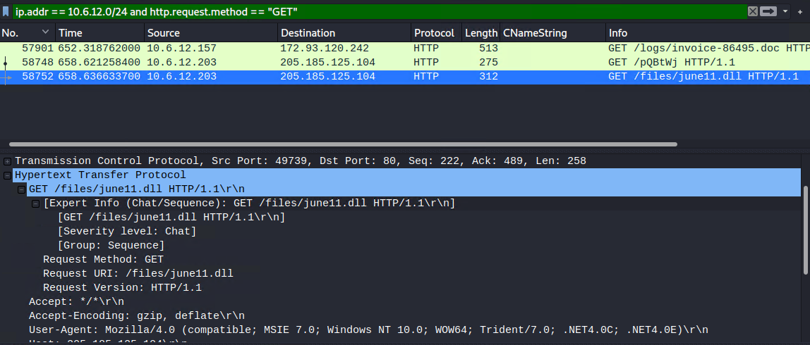
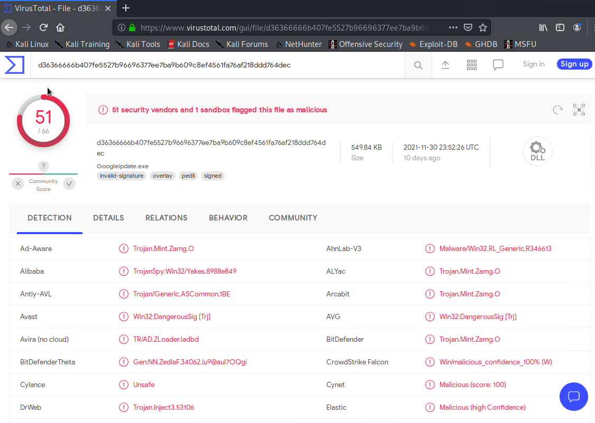
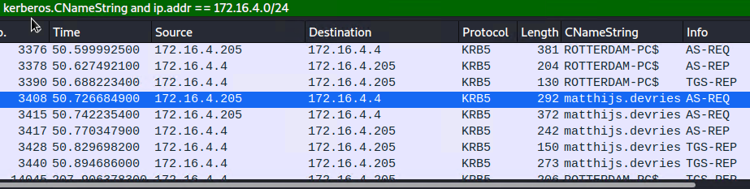
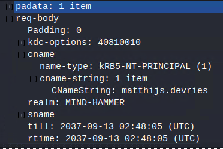
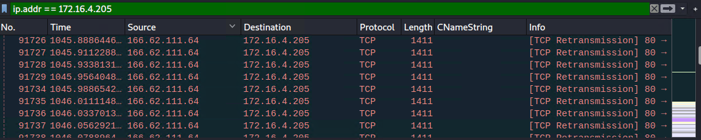
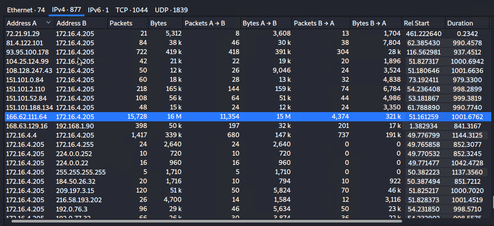
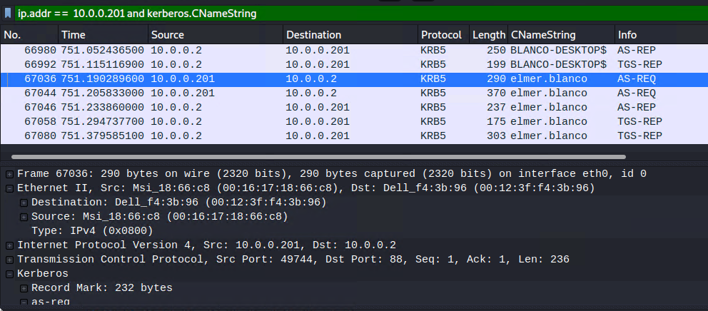
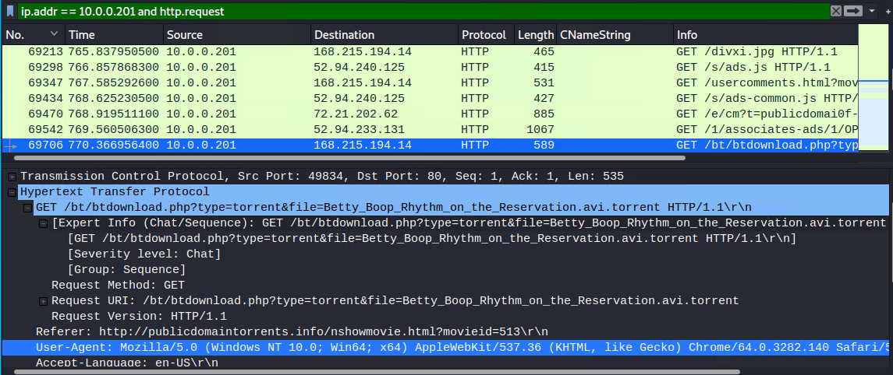

# Network Forensic Analysis Report

## Time Thieves 
You must inspect your traffic capture to answer the following questions:

1. What is the domain name of the users' custom site?
- The Domain name is Frank-n-Ted-DC.frank-n-nted.com

2. What is the IP address of the Domain Controller (DC) of the AD network?
- The ip address is 10.6.12.12

3. What is the name of the malware downloaded to the 10.6.12.203 machine?
- The malware is called june11.dll.

- Once you have found the file, export it to your Kali machine's desktop.
4. Upload the file to [VirusTotal.com](https://www.virustotal.com/gui/).

6. What kind of malware is this classified as?
- Cross Site Request Forgery (CSRF) 

---

## Vulnerable Windows Machine

1. Find the following information about the infected Windows machine:
    - Host name - Rotterdamn-PC
    - IP address - 172.16.4.205
    - MAC address - LenovoEM_b0:63:a4 (00:59:07:b0:63:a4)

    
2. What is the username of the Windows user whose computer is infected?
- matthijs.devries

3. What are the IP addresses used in the actual infection traffic?
-  166.62.111.64

## Illegal Downloads

1. Find the following information about the machine with IP address `10.0.0.201`:
    - MAC address - 00:16:17:18:66:c8
    - Windows username - elmer.blanco
    - OS version - Windows NT 10.0; Win64; x6

2. Which torrent file did the user download?
- Betty_Boop_Rhythm_on_the_Reservation.avi.torren

