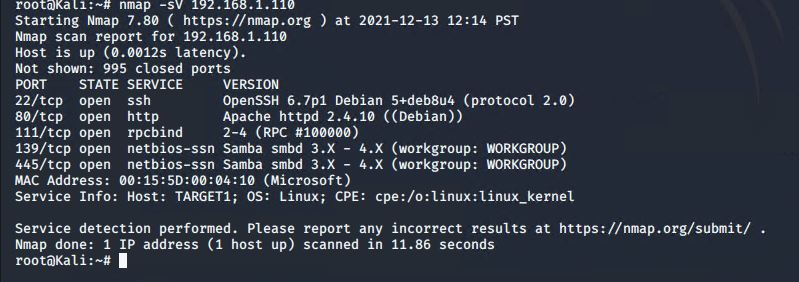

# Red Team: Summary of Operations

## Table of Contents
- Exposed Services
- Critical Vulnerabilities
- Exploitation

### Exposed Services

Nmap scan results for each machine reveal the below services and OS details:

```bash
$ nmap -sV 192.168.1.110



  Port 22/TCP Open SSH
  Port 80/TCP Open HTTP
  Port 111/TCP Open rcpbind
  Port 139/TCP Open netbios-ssn
  Port 445/TCP Open netbios-ssn
```

This scan identifies the services below as potential points of entry:
- Target 1
  - List of Exposed Services
   - Port 22/TCP Open SSH
   - Port 80/TCP Open HTTP


The following vulnerabilities were identified on each target:
- Target 1
  - allowed remote access usign ssh 
  - User enumeration
  - Weak Passwords 
  - Misconfiguration of priviledges 

### Exploitation

The Red Team was able to penetrate `Target 1` and retrieve the following confidential data:
- Target 1
  - `flag1{b9bbcb33e11b80be759c4e844862482d}`: _TODO: Insert `flag1.txt` hash value_
    - **Exploit Used**
      - used ssh to remote access target 1 and logged into micheal's account with an easy to guess password. 
      - Usernam: michael
      - Password: michael 
      - Commands used: 
        - ssh michael@192.168.1.110 -p22
        - cd ..
        - cd ..
        - cd var/www/html
        - ls
        - nano service.html
  - `flag2 {fc3fd58dcdad9ab23faca6e9a36e581c}`
    - **Exploit Used**
      - Same as flag1. A flag2.txt file was found by snooping around in Micheal's account folders
      - Commands used:
        - cd ..
        - cd ..
        - ls
        - cat flag2.txt
  - `flag3 {afc01ab56b50591e7dccf93122770cd2} 
  - `flag4 {715dea6c055b9fe3337544932f2941ce}
    - **Exploit Used** 
       - Used credentials from wp-config.php file for MYAQL database, I logged into MYSQL. Flags 3 and 4 were found in the wp_posts tabel in the MYAQL wordpress database   
